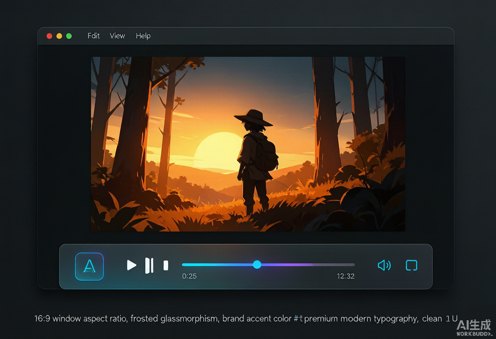
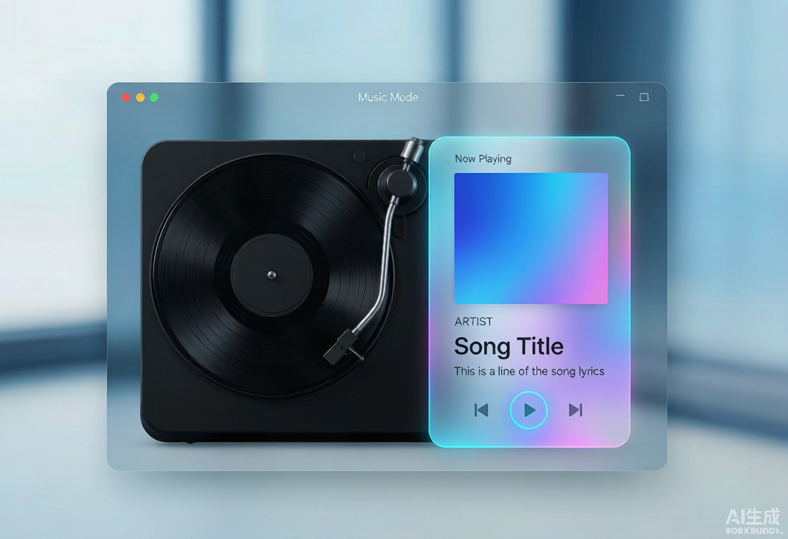
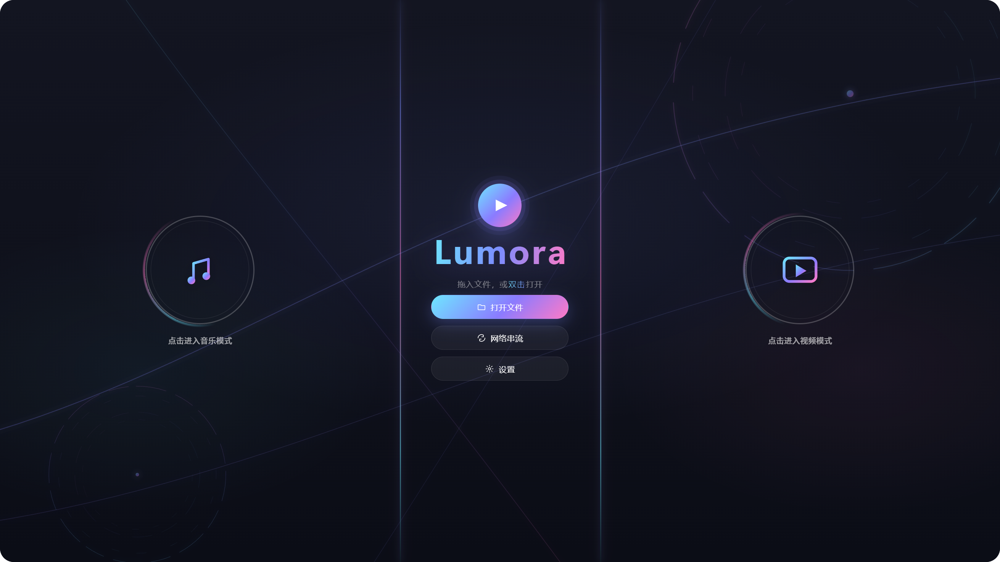
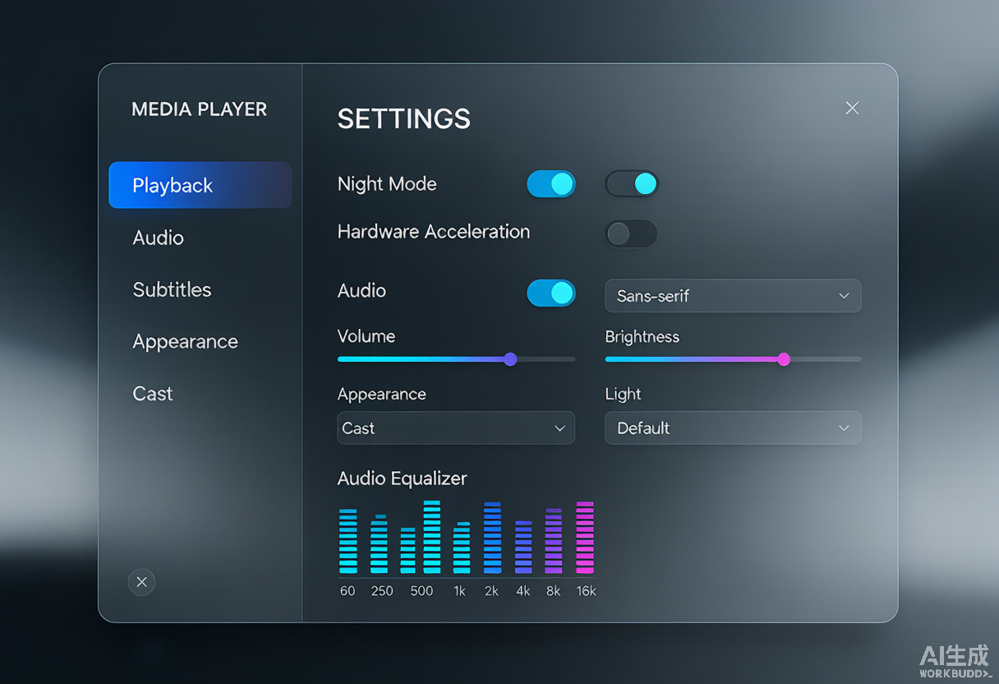

# 🎬 Lumora

> GPU 加速、键盘驱动的现代化媒体播放器 —— 基于 mpv（系统 / 硬件解码）+ Electron + WebGL2 渲染界面。


**Lumora** 是一台为「看得爽」而生的桌面播放器：把 mpv 的硬核解码能力、WebGL2 的丝滑界面，以及一套精致通透的设计语言（青→紫→粉渐变、毛玻璃）装进同一个窗口。视频、音乐、影视番剧与本地媒体库统一入口，内置弹幕、投屏、歌词与自动更新。

## 📸 界面截图

| 视频播放 | 音乐控制台 | 主页 / 音乐舞台 | 设置面板 |
|---|---|---|---|
|  |  |  |  |

## ✨ 功能特性

### 播放核心
- **全格式播放**：`mp4` `mkv` `webm` `mov` `ts` `m2ts` `flv` `wmv` `avi` … 以及 `mp3` `flac` `aac` `wav` `ogg` `opus` 等音轨；文件关联一键打开。
- **硬解与画质**：硬件解码（hwdec）、HDR、ICC 色彩管理、滤镜与色调映射、去色带、EWA Lanczos / Spline36 等缩放算法。
- **精准控制**：播放 / 暂停 / seek / 倍速 / 音量、A-V 音画同步、帧步进、章节与书签、鼠标手势。
- **双引擎**：视频模式懒启动 mpv（d3d11 硬解），音乐模式走 ffmpeg 纯音频管线，按内容自动选择后端。

### 音乐（网易云风格控制台）
- **音乐舞台**：封面 / 黑胶唱机 / 多种播放器样式（方形、封面、歌词、简约、玻璃、黑胶…）。
- **实时频谱**：真实 FFT 数据驱动，峰值缓动 + 拱形包络 + 柱间平滑，支持封面 / 歌词两种画布。
- **逐字歌词**：LRC 解析 + 自动校准偏移，逐字点亮跟唱（KTV 感），桌面歌词窗口同步着色。
- **音效**：10 段均衡器、交叉淡化切轨、睡眠定时、收藏红心。

### 观影增强
- **弹幕**：弹弹 play / B 站 / 聚合代理，开箱自动匹配。
- **字幕**：双字幕轨、在线字幕搜索（OpenSubtitles / 射手网）、自动提取内嵌字幕。
- **投屏**：DLNA v1 + Chromecast（CASTV2 / mDNS）投屏到局域网设备。
- **截图**：单张 / 序列截图；**画中画** 原生 PiP；**网络串流** 直接打开 URL。
- **专业媒体信息面板**：文件 / 显示 / 帧时间 / 视频 / 音频 / 渲染管线 / 传输 / 环境全量统计。
- **自动更新**：打包版启动后静默检查 GitHub Releases，后台下载，就绪后弹窗确认安装。

> 实验性：MediaFoundation 引擎（Windows 原生解码）在演进中；DLNA 接收端（DMR）暂未实现。

## 🚀 快速开始

```bash
git clone https://github.com/icebang01/lumora.git
cd lumora
npm install
npm run fetch-deps   # 拉取 ffmpeg / mpv 到 bin/（首次运行需要）
npm start            # 或 npm run dev 进入开发模式
```

> 需要本机已安装 mpv（系统解码后端，`fetch-deps` 会自动获取）。开发模式下「自动更新」不可用，属预期行为。

## ⌨️ 常用快捷键

| 按键 | 功能 |
|---|---|
| `空格` | 播放 / 暂停 |
| `←` `→` | 快退 / 快进 |
| `↑` `↓` | 音量 |
| `f` | 全屏 |
| `,` `.` | 上一帧 / 下一帧 |
| `i` | 媒体信息面板 |
| `F1` | 键位速查（完整可自定义键位） |
| `F2` | 设置面板 |

> 以上为常用键位（大致遵循 mpv 习惯），完整与可自定义键位请在播放器内按 `F1` 查看。

## 🛠️ 开发脚本

| 命令 | 说明 |
|---|---|
| `npm start` | 启动应用 |
| `npm run dev` | 开发模式（含调试） |
| `npm test` | 语法 + 单元(120) + 专项(70) + 类型检查 + 冒烟(22) |
| `npm run test:unit` | 单元测试（node:test） |
| `npm run test:smoke` | 冒烟测试（隔离 userData / config） |
| `npm run test:gui` | GUI 自动化测试（CDP 驱动，13 项） |
| `npm run typecheck` | TypeScript 类型检查（src/shared 契约层） |
| `npm run fetch-deps` | 拉取 ffmpeg / mpv 到 bin/ |
| `npm run dist` | 构建安装包（不发布） |
| `npm run release` | 构建并发布到 GitHub Releases |

## 📦 构建与发布

```bash
npm run dist     # 本地构建 NSIS 安装包
npm run release  # 构建并发布到 GitHub Releases
```

发布流程：打 `v*` tag 推送 → GitHub Actions 自动构建并发布（需要仓库 `GH_TOKEN` 且具备 `contents:write`）。

## 🧱 技术架构

- **Electron 33** 承载主进程与渲染进程；主进程按域拆分（IPC / 窗口 / 播放控制 / 媒体管线 / 更新…）。
- **mpv** 作为视频解码 / 渲染后端（d3d11 硬解），`--wid` 嵌入 videoWin 子窗口，JSON IPC + 命名管道控制。
- **ffmpeg** 作为音乐 / 备用视频管线：子进程解码 → 本地 WebSocket 二进制通道（32 字节定长包头）→ WebGL2 + AudioWorklet 渲染。
- **WebGL2 + AudioWorklet** 负责界面合成、视频帧呈现与音频处理（声部化 + 交叉淡化）。
- **模块化**：渲染端按面板 / 播放器 / 引擎分层，共享状态经 `setCtx` 注入（单一事实源留在宿主）；完整结构地图见 [`MODULES.md`](./MODULES.md)。

## 🎨 设计语言

暗色沉浸界面，品牌主色 `#7c8cff`，青→紫→粉渐变，毛玻璃（`blur(22px)`）质感，圆角与 `cubic-bezier(0.16,1,0.3,1)` 缓动。主页三栏舞台（最近播放 / 播放 / 快捷入口）与音乐控制台共用同一套设计令牌。

## 📁 项目结构（节选）

```
src/main/        主进程：窗口、解码编排、IPC（player/media/window/app/cast/updater 域）、自动更新
src/renderer/    渲染进程：app 主控、UI 面板（panels/）、播放器模块（player/）、引擎（core/）、界面（ui/）
src/shared/      主渲共享契约（protocol / 类型 / 常量）
tools/           测试与开发工具（冒烟 / GUI 测试 / 漏网扫描 / 媒体生成）
test/            单元测试（node:test）
docs/            ADR 决策记录 / 截图 / 验证清单
```

## 📜 许可证

版权所有 © ICE Bang! —— **保留所有权利（UNLICENSED）**，当前未开放源码许可。

第三方组件按其各自许可分发：mpv（GPLv2+，聚合分发）、ffmpeg（LGPLv3，经 `fetch-deps` 获取 BtbN 构建）、electron-updater（MIT）等。

---

品牌：**ICE Bang!** · 为创作者而生的播放器
